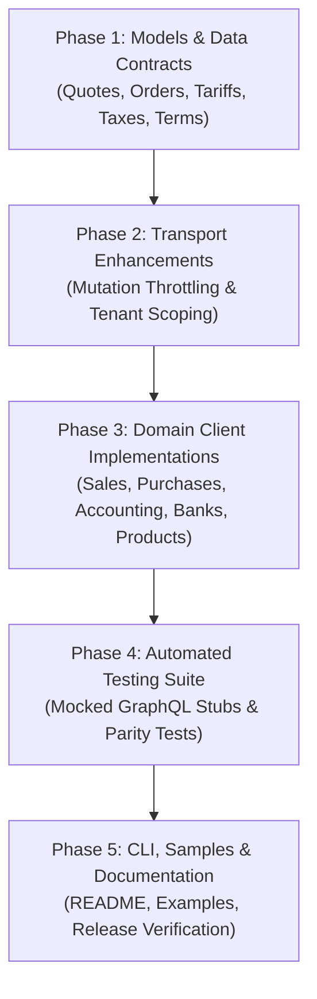

# Sage.Active (.NET) - Parity Expansion Plan

This plan outlines the evolutionary enhancement of **Sage.Active** (.NET) to achieve 100% feature parity with **sageactive4j** (Java SDK) following its Phase 6 enterprise coverage expansion.

---

## 1. Executive Summary & Objective

**sageactive4j** recently completed Phase 6 domain coverage, introducing several enterprise business operations from the Sage Active Public API V2 (GraphQL) Postman reference collection that were not yet explicitly typed in `Sage.Active`:
1. **Sales Quotes & Sales Orders** (creation, listing, lifecycle).
2. **Credit Note Generation** from posted sales invoices.
3. **Sales Tariffs** and stretch pricing.
4. **Fiscal Taxes, Tax Groups, Fiscal VAT Treatments, and Commercial Payment Terms**.
5. **Automated OCR Receipt Ingestion** (`AP_AUTOMATION`) and invoice tracking by OCR file ID.
6. **Bank Unreconciliation** (`unReconcileBankMovement`).
7. **Concurrency Throttling** (fair 10-mutation semaphore protecting Sage API limits).
8. **Per-Call Organization Scoping** (`WithOrganization(orgId)`).

**Objective**: Port these capabilities to `Sage.Active` while guaranteeing **zero breaking changes** to existing APIs, models, configurations, or consumer integrations.

---

## 2. Non-Breaking Backward Compatibility Guarantees

All changes under this plan **MUST** satisfy strict backward compatibility (SemVer minor release, e.g., `0.1.0` -> `0.2.0` or `1.0.0` -> `1.1.0`):

1. **No Breaking Signatures**:
   - Existing methods in `SalesClient`, `ProductsClient`, `AccountingClient`, `PurchasesClient`, `BanksClient`, `FilesClient`, `UsersClient`, `OrganizationsClient`, `CatalogClient`, and `LocalizationClient` will remain untouched.
   - New capabilities are added as **new methods** or **overloads with default parameter values**.
2. **No Breaking Data Contracts**:
   - Existing entity and input properties remain unchanged.
   - New entity classes (`SalesQuote`, `SalesOrder`, `SalesTariff`, `Tax`, `TaxGroup`, `TaxTreatment`, `PaymentTerm`, etc.) are placed in existing namespaces (`Sage.Active.Models.Entities` and `Sage.Active.Models.GraphQL`).
3. **Multi-Target Framework Compatibility**:
   - Code must build cleanly across all currently targeted frameworks: `netstandard2.0`, `netcoreapp3.1`, `net5.0`, `net6.0`, `net7.0`, `net8.0`, and `net9.0`.
   - Use `#if` preprocessor directives where modern C# features (e.g., `IAsyncEnumerable`, `DateOnly`) differ from .NET Standard 2.0.
4. **Zero New Mandatory External Dependencies**:
   - Keep the dependency surface minimal (`System.Text.Json` on `netstandard2.0`, built-in on modern .NET).
5. **Existing Tests and Samples Pass Unmodified**:
   - The existing test suite (`SageActiveClientTests`, `SageRateLimitTests`) and samples (`Sage.Active.Sample.Console`, `Sage.Active.Sample.MinimalApi`) must continue to compile and pass without modification.

---

## 3. Detailed Scope of Additions

### 3.1 Domain 1: Sales Quotes & Sales Orders (`SalesClient`)
Sage Active documents commercial negotiation documents prior to invoice closing:
- **Queries**:
  - `salesQuotes(order: [{ documentDate: DESC }], first: $first)` -> returns `Connection<SalesQuote>`
  - `salesOrders(order: [{ documentDate: DESC }], first: $first)` -> returns `Connection<SalesOrder>`
- **Mutations**:
  - `createSalesQuote(input: $values)` -> returns `SalesQuoteCreatedResult` (with `id`)
  - `createSalesOrder(input: $values)` -> returns `SalesOrderCreatedResult` (with `id`)
- **New Methods in `SalesClient`**:
  ```csharp
  Task<Connection<SalesQuote>> GetQuotesAsync(int first = 50, CancellationToken cancellationToken = default);
  Task<string> CreateQuoteAsync(SalesQuoteCreateInput input, CancellationToken cancellationToken = default);
  Task<Connection<SalesOrder>> GetOrdersAsync(int first = 50, CancellationToken cancellationToken = default);
  Task<string> CreateOrderAsync(SalesOrderCreateInput input, CancellationToken cancellationToken = default);
  ```

### 3.2 Domain 2: Credit Note Generation (`SalesClient`)
Sage Active provides a dedicated mutation to reverse or compensate a posted sales invoice:
- **Mutation**:
  - `generateCreditNote(input: { salesInvoiceId: $invoiceId })` -> returns `CreditNoteGeneratedResult` (with `id`)
- **New Method in `SalesClient`**:
  ```csharp
  Task<string> GenerateCreditNoteAsync(string salesInvoiceId, CancellationToken cancellationToken = default);
  ```

### 3.3 Domain 3: Sales Tariffs (`ProductsClient`)
Product catalog pricing rules and tariffs:
- **Query**:
  - `salesTariffs(order: [{ code: ASC }], first: $first)` -> returns `Connection<SalesTariff>`
- **New Method in `ProductsClient`**:
  ```csharp
  Task<Connection<SalesTariff>> GetTariffsAsync(int first = 50, CancellationToken cancellationToken = default);
  ```

### 3.4 Domain 4: Fiscal Taxes, Groups, VAT Treatments & Payment Terms (`AccountingClient`)
Fiscal setup required for accounting accuracy across France, Spain, Germany, and Portugal:
- **Queries**:
  - `taxes(first: $first)` -> returns `Connection<Tax>`
  - `taxGroups(first: $first)` -> returns `Connection<TaxGroup>`
  - `taxTreatments(first: $first)` -> returns `Connection<TaxTreatment>`
  - `paymentTerms(first: $first)` -> returns `Connection<PaymentTerm>`
- **New Methods in `AccountingClient`**:
  ```csharp
  Task<Connection<Tax>> GetTaxesAsync(int first = 50, CancellationToken cancellationToken = default);
  Task<Connection<TaxGroup>> GetTaxGroupsAsync(int first = 50, CancellationToken cancellationToken = default);
  Task<Connection<TaxTreatment>> GetTaxTreatmentsAsync(int first = 50, CancellationToken cancellationToken = default);
  Task<Connection<PaymentTerm>> GetPaymentTermsAsync(int first = 50, CancellationToken cancellationToken = default);
  ```

### 3.5 Domain 5: Automated OCR Receipt Ingestion (`PurchasesClient`)
Sage Active AP Automation ingests receipts/supplier bills using OCR:
- **Operations**:
  - Upload file with `entityType: "AP_AUTOMATION"`
  - Query `purchaseInvoices(where: { fileId: { eq: $fileId } })` to track processed results
- **New Methods in `PurchasesClient`**:
  ```csharp
  Task<string> UploadReceiptAsync(Stream fileStream, string fileName, string? comment = null, CancellationToken cancellationToken = default);
  Task<Connection<PurchaseInvoice>> GetInvoicesByFileIdAsync(string fileId, int first = 20, CancellationToken cancellationToken = default);
  Task<Connection<PurchaseInvoiceOpenItem>> GetOpenItemsAsync(string purchaseInvoiceId, CancellationToken cancellationToken = default);
  ```

### 3.6 Domain 6: Treasury & Bank Unreconciliation (`BanksClient`)
Reversing bank reconciliation when transactions were misallocated:
- **Mutation**:
  - `unReconcileBankMovement(input: { bankTransactionId: $bankTransactionId })` -> returns `unReconcileBankMovement.id`
- **New Method in `BanksClient`**:
  ```csharp
  Task<string> UnreconcileMovementAsync(string bankTransactionId, CancellationToken cancellationToken = default);
  ```

### 3.7 Domain 7: Concurrency & Mutation Throttling (`Transport`)
Sage Active imposes a limit of at most 10 concurrent mutations per app:
- Add `MaxConcurrentMutations` (default: 10, `0` = unlimited) to `SageActiveConfig`.
- In `SageGraphQLClient`, protect mutations using an asynchronous `SemaphoreSlim` so excess requests queue fairly instead of failing with HTTP 400/429.

### 3.8 Domain 8: Per-Call Organization Isolation (`SageActiveClient`)
For multi-tenant SaaS applications:
- Add `WithOrganization(string organizationId)` on `SageActiveClient`:
  - Returns a lightweight clone of `SageActiveClient` pointing to the designated tenant.
  - Reuses the underlying `HttpClient`, `SageAuthClient`, token cache, and mutation semaphore.

---

## 4. Implementation Plan & Phases



### Phase 1: Models & Data Contracts (Additive Only)
Create new entity classes under `src/Sage.Active/Models/Entities`:
- `SalesQuote.cs`, `SalesQuoteLine.cs`, `SalesQuoteCreateInput.cs`, `SalesQuoteLineInput.cs`
- `SalesOrder.cs`, `SalesOrderLine.cs`, `SalesOrderCreateInput.cs`, `SalesOrderLineInput.cs`
- `SalesTariff.cs`, `TariffStretch.cs`
- `Tax.cs`, `TaxGroup.cs`, `TaxTreatment.cs`, `PaymentTerm.cs`
- `PurchaseInvoiceOpenItem.cs`

### Phase 2: Transport & Resilience Enhancements
1. Update `SageActiveConfig`:
   - Add property `public int MaxConcurrentMutations { get; set; } = 10;`
2. Update `SageGraphQLClient`:
   - Initialize `SemaphoreSlim? _mutationSemaphore` when `MaxConcurrentMutations > 0`.
   - Acquire semaphore during mutations (queries pass unthrottled).
3. Update `SageActiveClient`:
   - Implement `public SageActiveClient WithOrganization(string organizationId)`.

### Phase 3: Service Subclients
1. Extend `SalesClient`:
   - Add `GetQuotesAsync`, `CreateQuoteAsync`.
   - Add `GetOrdersAsync`, `CreateOrderAsync`.
   - Add `GenerateCreditNoteAsync`.
2. Extend `ProductsClient`:
   - Add `GetTariffsAsync`.
3. Extend `AccountingClient`:
   - Add `GetTaxesAsync`, `GetTaxGroupsAsync`, `GetTaxTreatmentsAsync`, `GetPaymentTermsAsync`.
4. Extend `PurchasesClient`:
   - Add `GetOpenItemsAsync`.
   - Add `UploadReceiptAsync`.
   - Add `GetInvoicesByFileIdAsync`.
5. Extend `BanksClient`:
   - Add `UnreconcileMovementAsync`.

### Phase 4: Testing & Verification
1. Add unit tests in `tests/Sage.Active.Tests`:
   - `SalesQuotesAndOrdersTests.cs`: test quote/order query & mutation formatting.
   - `CreditNotesAndTariffsTests.cs`: test credit note generation & tariff list.
   - `AccountingTaxesAndTermsTests.cs`: test taxes, groups, treatments & payment terms.
   - `OcrPurchasesAndUnreconcileTests.cs`: test receipt upload & unreconcile.
   - `MutationSemaphoreTests.cs`: test concurrent mutation throttling.
   - `WithOrganizationTests.cs`: test tenant header override.
2. Verify all existing tests pass (`dotnet test` across all 7 target frameworks).

### Phase 5: Documentation & Release
1. Update `README.md` with:
   - Quotes and orders snippets.
   - OCR receipt ingestion snippet.
   - Credit note & tax queries.
   - `WithOrganization` usage.
2. Validate samples build and run:
   - `Sage.Active.Sample.Console`
   - `Sage.Active.Sample.MinimalApi`

---

## 5. Verification Checklist

- [ ] All new methods and models compile under `netstandard2.0`, `netcoreapp3.1`, `net5.0`, `net6.0`, `net7.0`, `net8.0`, `net9.0`.
- [ ] No existing public API method or property modified or removed.
- [ ] Concurrency semaphore allows queries without throttling while capping active mutations at 10.
- [ ] All unit and integration tests pass with 0 failures and 0 warnings.
- [ ] `Sage.Active.Cli` continues to build and run cleanly.
