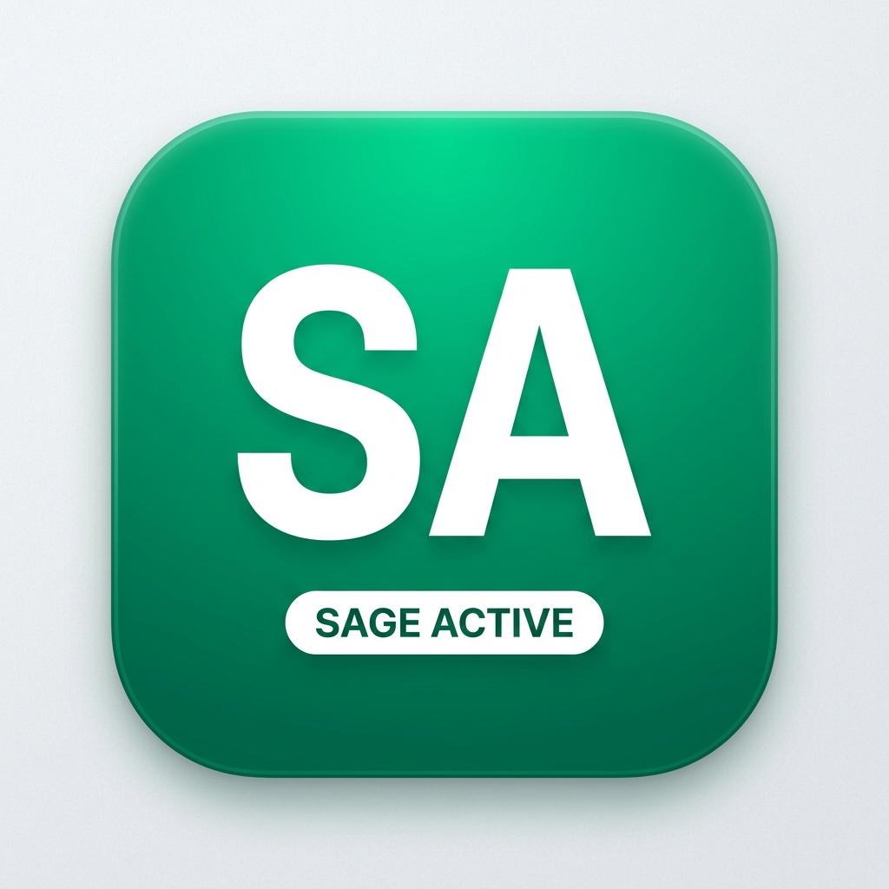
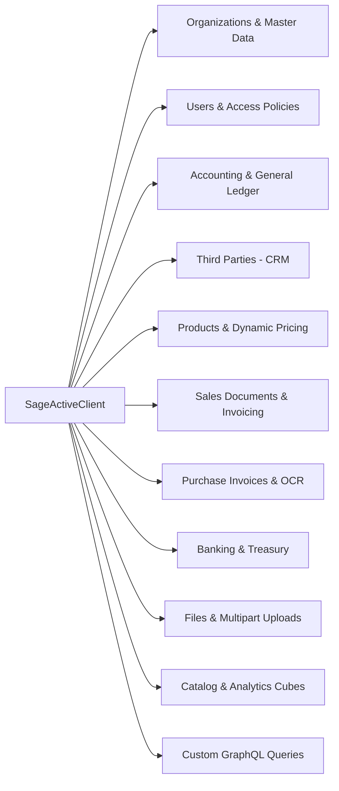

<p align="center">
  
</p>

<h1 align="center">Sage.Active</h1>

<p align="center">
  <strong>Idiomatic, enterprise-grade .NET Client SDK, ASP.NET Core Adapter, and Global CLI Tool for the Sage Active Public API V2 (GraphQL).</strong>
</p>

<p align="center">
  <a href="https://www.nuget.org/packages/Sage.Active"></a>
  <a href="https://www.nuget.org/packages/Sage.Active"></a>
  <a href="https://github.com/JoseModi97/sage-active-dotnet/actions/workflows/release.yml"></a>
  <a href="LICENSE"></a>
  <a href="https://dotnet.microsoft.com/"></a>
</p>

An all-in-one .NET library and CLI companion for **Sage Active Public API V2** (powered by Hot Chocolate GraphQL). Built with zero unnecessary dependencies, automated OAuth 2.0 SBC Auth token refreshing, rate limit backoff (3,000 req/min), multi-legislation support (France, Spain, Germany, Portugal), and typed models covering **all 468+ API operations**.

Authored by [Jose Modi](https://github.com/JoseModi97) / [Modi97](https://www.nuget.org/profiles/Modi97).

---

## Table of Contents

- [Highlights](#highlights)
- [Package Suite](#package-suite)
- [Installation](#installation)
- [Zero-Code CLI Tool (`sage-active`)](#zero-code-cli-tool-sage-active)
- [Quickstart: ASP.NET Core Minimal APIs](#quickstart-aspnet-core-minimal-apis)
- [Quickstart: ASP.NET Core MVC](#quickstart-aspnet-core-mvc)
- [Quickstart: Standalone C# Script](#quickstart-standalone-c-script)
- [Core Architecture & Services](#core-architecture--services)
- [Order-to-Cash Workflow (Invoicing & Settlement)](#order-to-cash-workflow-invoicing--settlement)
- [General Ledger & Accounting Entries](#general-ledger--accounting-entries)
- [Multipart File Uploads & OCR Processing](#multipart-file-uploads--ocr-processing)
- [Dynamic Multidimensional Analytics Cubes](#dynamic-multidimensional-analytics-cubes)
- [Regional Gateways & Sandboxes](#regional-gateways--sandboxes)
- [.NET Compatibility Matrix](#net-compatibility-matrix)
- [Contributing & License](#contributing--license)

---

## Highlights

* **100% Wire Coverage**: Directly supports every single operation from Sage's 468-request Postman library across General Ledger, Accounting, Sales Invoicing, Purchase Invoices, Banking, Third Parties, Products, OCR, and Catalog Analytics.
* **Universal .NET Compatibility**: Multi-targeted for `netstandard2.0`, `netcoreapp3.1`, `net5.0`, `net6.0`, `net7.0`, `net8.0`, and `net9.0` (compatible with .NET Framework 4.6.1+, .NET 5+, and all modern .NET releases).
* **Zero-Code Setup CLI**: Companion global tool (`dotnet-sage-active` / `sage-active`) with interactive onboarding wizard, connectivity diagnostics, organization switcher, and project scaffolder.
* **Production-Ready Resilience**: Automatic OAuth 2.0 SBC Auth token acquisition, token refresh with thread-safe locking, exponential backoff on HTTP 429 (3,000 req/min limit), and GraphQL multipart uploads.
* **First-Class ASP.NET Core**: Clean dependency injection (`AddSageActive`), Minimal API routes (`MapSageWebhook`), and health check extensions.

---

## Package Suite

| Package | NuGet ID | Target Frameworks | Description |
|---|---|---|---|
| **Core SDK** | [`Sage.Active`](https://www.nuget.org/packages/Sage.Active) | `netstandard2.0`, `netcoreapp3.1`, `net5.0`, `net6.0`, `net7.0`, `net8.0`, `net9.0` | Core GraphQL engine, SBC Auth, entities, and 11 domain subclients |
| **ASP.NET Core** | [`Sage.Active.AspNetCore`](https://www.nuget.org/packages/Sage.Active.AspNetCore) | `netstandard2.0`, `netcoreapp3.1`, `net5.0`, `net6.0`, `net7.0`, `net8.0`, `net9.0` | Dependency Injection (`AddSageActive`) and Minimal API webhook mapping |
| **Global CLI** | [`dotnet-sage-active`](https://www.nuget.org/packages/dotnet-sage-active) | `net8.0` (runs on .NET 8, 9, 10+) | Terminal setup wizard, self-tests, sandbox invoice generator, and query runner |

---

## Installation

### Core SDK
```bash
dotnet add package Sage.Active
```

### ASP.NET Core Integration
```bash
dotnet add package Sage.Active.AspNetCore
```

### Global CLI Tool
```bash
dotnet tool install --global dotnet-sage-active
```

---

## Zero-Code CLI Tool (`sage-active`)

The `sage-active` CLI tool allows you to configure, test, and operate Sage Active without writing code:

```
   _____                   ___         __  _           
  / ___/____ _____ ____   /   |  _____/ /_(_)   _____  
  \__ \/ __ `/ __ `/ _ \ / /| | / ___/ __/ / | / / _ \ 
 ___/ / /_/ / /_/ /  __// ___ |/ /__/ /_/ /| |/ /  __/ 
/____/\__,_/\__, /\___//_/  |_|\___/\__/_/ |___/\___/  
           /____/                                      
```

### CLI Command Reference

| Command | Description | Example |
|---|---|---|
| `sage-active init` | Interactive setup wizard (prompts for region, sandbox/prod, credentials, queries organizations, and saves configuration) | `sage-active init` |
| `sage-active test` | Self-test connectivity, user profile, and validates permissions using `userAccessPolicyCheck` | `sage-active test` |
| `sage-active org` | Lists available organizations and shows which organization is currently active | `sage-active org` |
| `sage-active org set <id>` | Switches the active organization ID | `sage-active org set 0000-0000-0000` |
| `sage-active query "<query>"` | Runs an arbitrary GraphQL query or executes a `.graphql` query file | `sage-active query "{ userProfile { fullName } }"` |
| `sage-active invoice [list]` | Lists recent sales invoices | `sage-active invoice` |
| `sage-active invoice create` | Creates and posts a test sales invoice in Sandbox | `sage-active invoice create` |
| `sage-active scaffold [minimal\|console]` | Generates ready-to-run starter code in the current directory | `sage-active scaffold minimal` |

---

## Quickstart: ASP.NET Core Minimal APIs

### 1. Configure Credentials (`appsettings.json`)
```json
{
  "SageActive": {
    "Region": "FR",
    "Environment": "Sandbox",
    "SubscriptionKey": "YOUR_SAGE_SUBSCRIPTION_KEY",
    "OrganizationId": "YOUR_SAGE_ORGANIZATION_ID",
    "ClientId": "YOUR_CLIENT_ID",
    "ClientSecret": "YOUR_CLIENT_SECRET"
  }
}
```

### 2. Register & Map Endpoints (`Program.cs`)
```csharp
using Sage.Active;
using Sage.Active.AspNetCore;
using Sage.Active.Models.Entities;

var builder = WebApplication.CreateBuilder(args);

// Register Sage Active SDK via Dependency Injection
builder.Services.AddSageActive(builder.Configuration);

var app = builder.Build();

// Query Chart of Accounts
app.MapGet("/accounting/accounts", async (SageActiveClient client) =>
{
    var accounts = await client.Accounting.GetAccountsAsync();
    return Results.Ok(accounts.Nodes);
});

// Create and Post Sales Invoice in one operation
app.MapPost("/sales/invoice", async (SageActiveClient client, SalesInvoiceCreateInput input) =>
{
    var result = await client.Sales.CreateAndPostInvoiceAsync(input);
    return Results.Ok(new
    {
        invoiceId = result.InvoiceId,
        operationalNumber = result.OperationalNumber,
        accountingEntry = result.AccountingEntryNumber
    });
});

// Receive Webhooks
app.MapSageWebhook("/sage/webhook", async (payload, ctx) =>
{
    Console.WriteLine($"Received Sage Event: {payload}");
    await Task.CompletedTask;
});

app.Run();
```

---

## Quickstart: ASP.NET Core MVC

```csharp
using System.Threading.Tasks;
using Microsoft.AspNetCore.Mvc;
using Sage.Active;
using Sage.Active.Models.Entities;

namespace MyApp.Controllers
{
    [ApiController]
    [Route("api/[controller]")]
    public class AccountingController : ControllerBase
    {
        private readonly SageActiveClient _sage;

        public AccountingController(SageActiveClient sage)
        {
            _sage = sage;
        }

        [HttpGet("accounts")]
        public async Task<IActionResult> GetAccounts()
        {
            var accounts = await _sage.Accounting.GetAccountsAsync();
            return Ok(accounts.Nodes);
        }

        [HttpPost("invoices")]
        public async Task<IActionResult> CreateInvoice([FromBody] SalesInvoiceCreateInput input)
        {
            var (invoiceId, number, entryNumber) = await _sage.Sales.CreateAndPostInvoiceAsync(input);
            return Ok(new { invoiceId, number, entryNumber });
        }
    }
}
```

---

## Quickstart: Standalone C# Script

```csharp
using System;
using System.Threading.Tasks;
using Sage.Active;
using Sage.Active.Models;

var config = new SageActiveConfig
{
    Region = SageRegion.FR,
    Environment = SageEnvironment.Sandbox,
    SubscriptionKey = "YOUR_SUBSCRIPTION_KEY",
    OrganizationId = "YOUR_ORGANIZATION_ID",
    AccessToken = "YOUR_BEARER_TOKEN"
};

var client = new SageActiveClient(config);

// 1. Verify User Profile
var profile = await client.Users.GetUserProfileAsync();
Console.WriteLine($"Connected as: {profile.FullName} ({profile.AuthenticationEmail})");

// 2. Query Active Customers
var customers = await client.ThirdParties.GetCustomersAsync(onlyActive: true);
foreach (var customer in customers.Nodes)
{
    Console.WriteLine($"Customer: {customer.Code} - {customer.SocialName}");
}
```

---

## Core Architecture & Services



### Complete API Domain Services

* **`client.Organizations`**: Query organizations, onboarding state, legislation codes, countries, zip codes, and currencies.
* **`client.Users`**: Retrieve authenticated user profile, users list, and validate action authorizations via `userAccessPolicyCheck`.
* **`client.Accounting`**: Full chart of accounts, fiscal periods (`accountingExercises`), journal types, tax treatments, balanced GL entries (`createAccountingEntryUsingCodes`), trial balance, balance sheet, and profit & loss.
* **`client.ThirdParties`**: Manage customers, suppliers, employees, multiple addresses, and contacts.
* **`client.Products`**: Product catalog, units of measurement, dynamic price evaluation (`productPriceById`), and sales tariffs.
* **`client.Sales`**: Order-to-cash lifecycle (Quotes $\rightarrow$ Orders $\rightarrow$ Delivery Notes $\rightarrow$ Sales Invoices $\rightarrow$ Credit Notes). Includes automated validation (`closeSalesInvoice`), GL posting (`postSalesInvoice`), and open item settlement (`salesOpenItemSettlement`).
* **`client.Purchases`**: Purchase invoices, AP ledger posting, payables settlement, and automated OCR ingestion.
* **`client.Banks`**: Connected bank accounts, bank statement movements, matching rules, and bank reconciliation (`reconcileBankMovement`).
* **`client.Files`**: GraphQL multipart file attachments to entities, secure download links, and bulk ZIP export.
* **`client.Catalog`**: Multidimensional analytical cubes (`aggregationCatalog`/`aggregationExecute`) and standardized query lists (`listCatalog`/`listExecute`).
* **`client.ExecuteQueryAsync<T>`**: Direct raw GraphQL execution escape hatch for any query, mutation, or schema extension.

---

## Order-to-Cash Workflow (Invoicing & Settlement)

Create draft invoices, finalize document numbering, post to general ledger, and record customer payments:

```csharp
// 1. Create, validate, and post invoice in one line
var (invoiceId, operationalNumber, glEntryNumber) = await client.Sales.CreateAndPostInvoiceAsync(new SalesInvoiceCreateInput
{
    CustomerId = "CUSTOMER_UUID",
    DocumentDate = DateTimeOffset.UtcNow.ToString("yyyy-MM-dd"),
    Lines = new List<SalesInvoiceLineInput>
    {
        new SalesInvoiceLineInput
        {
            ProductId = "PRODUCT_UUID",
            Quantity = 2,
            UnitPrice = 150.00m,
            Description = "Consulting Services"
        }
    }
});

// 2. Query open receivables
var openItems = await client.Sales.GetOpenItemsAsync(invoiceId);

// 3. Settle open item payment
foreach (var item in openItems.Nodes)
{
    var settlement = await client.Sales.SettleOpenItemAsync(new SalesOpenItemSettlementInput
    {
        SalesInvoiceOpenItemId = item.Id,
        Amount = item.Amount,
        PaymentMethodId = "PAYMENT_METHOD_UUID",
        SettlementDate = DateTimeOffset.UtcNow.ToString("yyyy-MM-dd")
    });

    Console.WriteLine($"Settled in Accounting Entry: {settlement.AccountingEntryNumber}");
}
```

---

## General Ledger & Accounting Entries

Post multi-line balanced accounting entries directly using account and third-party codes:

```csharp
var entry = await client.Accounting.CreateEntryUsingCodesAsync(new AccountingEntryCreateUsingCodesInput
{
    Description = "Sales Invoice #INV-2026-001",
    Date = "2026-09-16",
    JournalTypeCode = "VTE", // Sales Journal
    Lines = new List<AccountingEntryLineInput>
    {
        new AccountingEntryLineInput
        {
            SubAccountCode = "411000", // Customer Account
            ThirdCode = "CUST001",
            DebitAmount = 120.00m,
            CreditAmount = 0
        },
        new AccountingEntryLineInput
        {
            SubAccountCode = "706000", // Revenue Account
            DebitAmount = 0,
            CreditAmount = 100.00m
        },
        new AccountingEntryLineInput
        {
            SubAccountCode = "445710", // VAT Output Account
            DebitAmount = 0,
            CreditAmount = 20.00m
        }
    }
});

Console.WriteLine($"GL Entry #{entry.Number} created with ID: {entry.Id}");
```

---

## Multipart File Uploads & OCR Processing

Attach receipts and invoices to entities using standard GraphQL multipart specifications:

```csharp
using var fileStream = File.OpenRead("receipt.pdf");

var fileId = await client.Files.UploadFileToEntityAsync(
    entityType: "CUSTOMER",
    entityId: "CUSTOMER_UUID",
    fileStream: fileStream,
    fileName: "receipt.pdf",
    comment: "Proof of purchase"
);

Console.WriteLine($"Uploaded File ID: {fileId}");
```

---

## Dynamic Multidimensional Analytics Cubes

Query business KPIs and sales cubes grouped by period, customer, or product:

```csharp
var cube = await client.Catalog.ExecuteAggregationAsync(new AggregationExecuteInput
{
    EntityKey = "queryAggregateSalesInvoices",
    AggregationType = "SUM",
    PeriodType = "Month",
    DateMin = "2026-01-01",
    DateMax = "2026-12-31",
    GroupByName = "Customer",
    ValueColumn1 = "Total Net",
    ValueColumn2 = "Total Liquid",
    Top = 5
});

foreach (var row in cube.Rows)
{
    Console.WriteLine($"{row.GroupValue} ({row.Period}): Net={row.Value1:C2}, Total={row.Value2:C2} (Delta: {row.DeltaPercent}%)");
}
```

---

## Regional Gateways & Sandboxes

Preconfigured endpoints for all European legislations:

| Region | Country | Gateway Address | Auth Server |
|---|---|---|---|
| **FR** | France | `https://api.fr.active.sage.com` | `https://sbcauth.sage.fr` |
| **ES** | Spain | `https://api.es.active.sage.com` | `https://sbcauth.sage.fr` |
| **DE** | Germany | `https://api.de.active.sage.com` | `https://sbcauth.sage.fr` |
| **PT** | Portugal | `https://api.es.active.sage.com` | `https://sbcauth.sage.fr` |

---

## .NET Compatibility Matrix

| .NET Version / Platform | Support Mode |
|---|---|
| **.NET 5.0** | **Native Target (`net5.0`) + Fallback (`netstandard2.0`)** |
| **.NET 6.0, 7.0, 8.0, 9.0, 10.0+** | **Native Targets (`net6.0`, `net7.0`, `net8.0`, `net9.0`)** |
| **.NET Core (2.0 – 3.1)** | **Supported via `netcoreapp3.1` and `netstandard2.0`** |
| **.NET Framework (4.6.1 – 4.8.1)** | **Supported via `netstandard2.0`** |
| **Mono / Xamarin / Unity / MAUI** | **Supported via `netstandard2.0`** |

---

## Contributing & License

Contributions are welcome! Please feel free to open issues or submit pull requests.

MIT License © [Jose Modi](https://github.com/JoseModi97) / [Modi97](https://www.nuget.org/profiles/Modi97)
